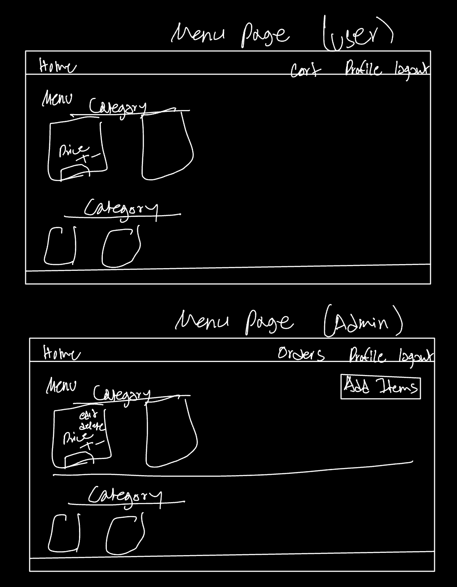
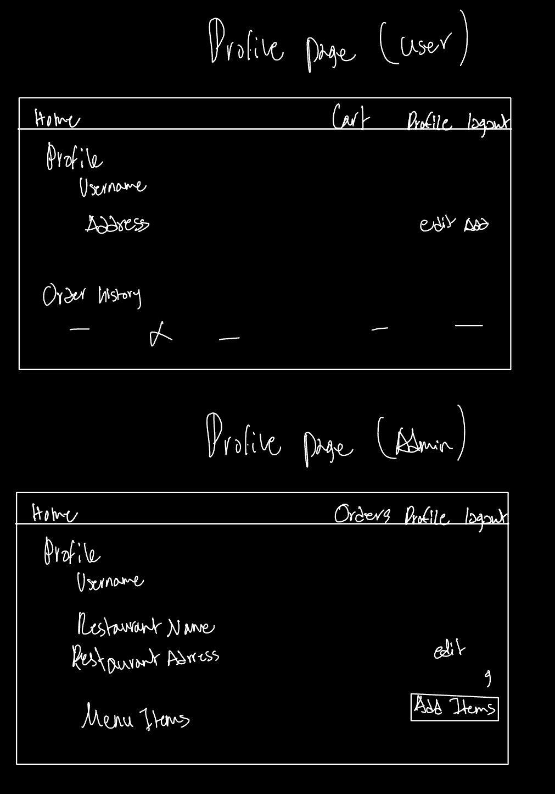
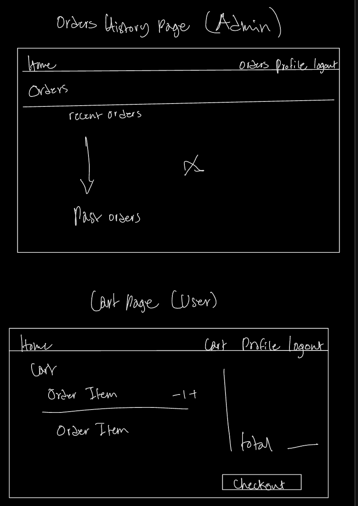

# online-restaurant-django-project

## 🚀 Live Demo

## Introduction

## ERD

## User Stories
### Admin User Stories
#### Menu Management
- As an admin, I can add menu items to the system by specifying the name, description, price, category, and image so that they appear in the restaurant's menu.
- As an admin, I can edit menu items to update their details, such as price or availability, ensuring that the menu remains up-to-date.
- As an admin, I can delete menu items that are no longer available or relevant to keep the menu clean and accurate.
- As an admin, I can create and manage categories for menu items to organize the menu (e.g., Appetizers, Main Course, Desserts).
#### Order Management
- As an admin, I can view all orders placed by users in the restaurant, including details like ordered items, quantities, and the order status, to manage the order fulfillment process.
- As an admin, I can update the status of an order (e.g., Preparing, Ready, Delivered) to keep users informed of their order progress.
#### Restaurant Profile Management
- As an admin, I can view and edit my restaurant’s profile, including the restaurant name and address, to ensure the information is accurate.
- As an admin, I can change the restaurant’s menu structure by adding, editing, or removing categories.
#### Account Management
- As an admin, I can view my account details, such as username and email, to ensure my profile is accurate.


### User Stories
#### Menu Browsing
- As a user, I can view the restaurant’s menu, organized by categories, so that I can easily find the items I want to order.
#### Cart Management
- As a user, I can add menu items to my cart by specifying the quantity, so I can prepare my order.
- As a user, I can view the contents of my cart to review the items and total price before placing the order.
- As a user, I can edit items in my cart, such as changing the quantity or removing an item, to make adjustments to my order.
- As a user, I can clear my entire cart if I decide to cancel my selections.
#### Order Placement
- As a user, I can place an order by confirming my cart, so the restaurant receives my request for fulfillment.
- As a user, I can view the status of my current order (e.g., Preparing, Ready, Delivered) to track its progress.
#### Order History
- As a user, I can view my past orders, including the items, prices, and order dates, to keep a record of my purchases.
#### Profile Management
- As a user, I can view my account details, such as name, email, and phone number, to ensure my profile information is accurate.

## Pseudo Code
### Admin Functions
#### Create a new menu item:
``` 
Function addMenuItem(name, description, price, category, image, available):
    Create new MenuItem object with the provided details
    Save MenuItem to the database
    Return success message
```
#### Edit Menu Item
```
Function editMenuItem(menuItemId, updatedDetails):
    Fetch MenuItem object by menuItemId
    If MenuItem exists:
        Update fields with updatedDetails
        Save changes to the database
        Return success message
    Else:
        Return error message
```
#### Delete Menu Item
```
Function deleteMenuItem(menuItemId):
    Fetch MenuItem object by menuItemId
    If MenuItem exists:
        Delete MenuItem from the database
        Return success message
    Else:
        Return error message
```
#### View Orders
```
Function viewOrders():
    Fetch all Order objects from the database
    For each order:
        Display order details (user, items, status, total price)
    Return orders list
```
#### Update Order Status
```
Function updateOrderStatus(orderId, newStatus):
    Fetch Order object by orderId
    If Order exists:
        Update status to newStatus
        Save changes to the database
        Return success message
    Else:
        Return error message
```
#### Update Restaurant Profile
```
Function updateRestaurantProfile(name, address):
    Fetch Restaurant object
    If Restaurant exists:
        Update name and address
        Save changes to the database
        Return success message
    Else:
        Return error message
```

### User Functions
#### View Menu
```
Function viewMenu():
    Fetch all MenuItem objects categorized by their category
    Return categorized menu list
```
#### Add Item to Cart
```
Function addToCart(userId, menuItemId, quantity):
    Fetch MenuItem by menuItemId
    If MenuItem is available:
        Create or update CartItem object for the user
        Update quantity in the CartItem
        Return success message
    Else:
        Return error message
```
#### View Cart
```
Function viewCart(userId):
    Fetch all CartItem objects for the user
    Calculate total price
    Return cart items and total price
```
#### Edit Cart Item
```
Function editCartItem(userId, cartItemId, newQuantity):
    Fetch CartItem by cartItemId for the user
    If CartItem exists:
        If newQuantity > 0:
            Update quantity
            Save changes to the database
            Return success message
        Else:
            Delete CartItem
            Return success message
    Else:
        Return error message
```
#### Place Order
```
Function placeOrder(userId):
    Fetch all CartItem objects for the user
    If Cart is not empty:
        Create new Order object
        Add CartItems to the Order as OrderItems
        Calculate and update total price
        Save Order to the database
        Clear Cart for the user
        Return success message
    Else:
        Return error message
```
#### View Order History
```
Function viewOrderHistory(userId):
    Fetch all Order objects for the user
    Return list of past orders with details
```

### Profile Management
#### View Profile
```
Function viewProfile(userId):
    Fetch User object by userId
    Return user details
```
#### Update Profile
```
Function updateProfile(userId, updatedDetails):
    Fetch User object by userId
    If User exists:
        Update fields with updatedDetails
        Save changes to the database
        Return success message
    Else:
        Return error message
```

## Mockups
### Menu Page

### Profile Page

### Order History and Cart Page


### Menu Page


### Profile Page


### Cart and Orders Page


## Data Models


## Routes
### User routes
| Action | Route                                   | HTTP Verb |
|--------|-----------------------------------------|-----------|
| Index  | `/users`                                | GET       |
| Show   | `/users/:userId`                        | GET       |
| Edit   | `/users/:userId/edit`                   | GET       |
| Update | `/users/:userId`                        | PUT       |
| Delete | `/users/:userId`                        | DELETE    |

### Order routes
| Action | Route                                   | HTTP Verb |
|--------|-----------------------------------------|-----------|
| Index  | `/orders`                               | GET       |
| New    | `/orders/new`                           | GET       |
| Create | `/orders`                               | POST      |
| Show   | `/orders/:orderId`                      | GET       |
| Edit   | `/orders/:orderId/edit`                 | GET       |
| Update | `/orders/:orderId`                      | PUT       |
| Delete | `/orders/:orderId`                      | DELETE    |

### Items routes
| Action | Route                                   | HTTP Verb |
|--------|-----------------------------------------|-----------|
| Index  | `/items`                               | GET       |
| New    | `/items/new`                           | GET       |
| Create | `/items`                               | POST      |
| Show   | `/items/:orderId`                      | GET       |
| Edit   | `/items/:orderId/edit`                 | GET       |
| Update | `/items/:orderId`                      | PUT       |
| Delete | `/items/:orderId`                      | DELETE    |

## Technologies
 - HTML
 - CSS
 - Bulma (CSS Framework)
 - Python
 - PostgreSQL
 - Django

## Attributions
- [Bulma (CSS Framework)](https://bulma.io/)

## Future Work